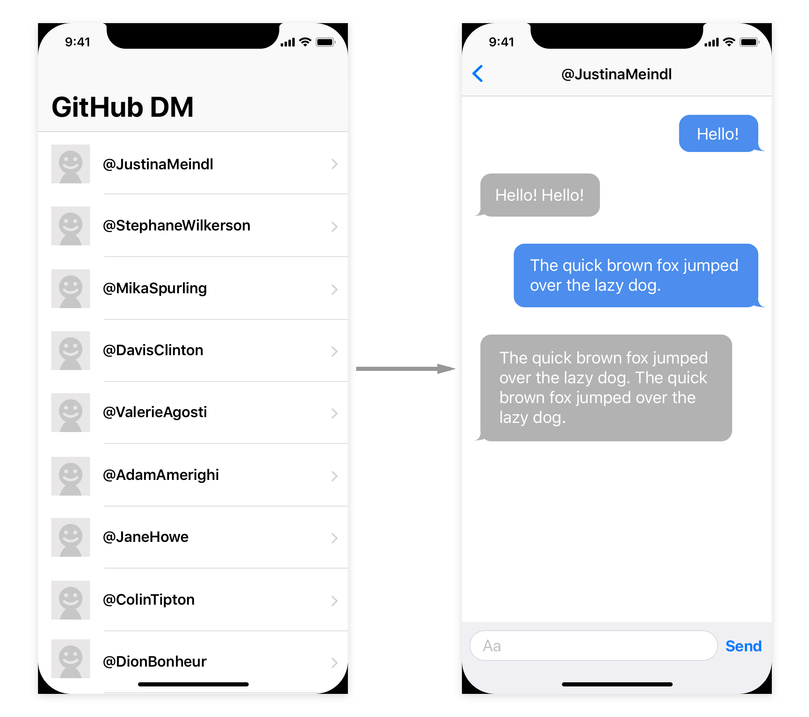

# Task

Using one of the two hypothetical scenarios below, please write a simple GitHub Direct Messaging app.

# Scenario

You are tech-lead of an iOS team with 5 members, who is planning on developing a new iOS app. It will be a long term project, with both development and maintenance being handled within the team. Before starting development with your team members, you are going to design the app and as the tech lead, implement the main fundamental functionalities.

# Minimum Specification

The submitted application must perform, at minimum, the following tasks:

* Show a list of users retrieved from any publicly available GitHub user account on the initial screen.
    * Make sure to show each user's GitHub handle (i.e., their account name with the '@' prefix) and their profile image on this screen.
    * Use the [GET users](https://developer.github.com/v3/users/#get-all-users) endpoint to retrieve the list of users.
      * This API can be accessed without authentication, but it also requires error handling since [it has rate limit](https://developer.github.com/v3/#rate-limiting)
* Tapping any of these followers will transition to a direct messaging (DM) screen.
* The user can virtually send/receive messages to/from the follower on the message screen.
  * Please do NOT actually call the GitHub API at this point.
  * Implement a dummy post and response.
    * The follower echoes a message sent by the user after a second.
    * The follower’s echo text repeats the user’s message twice, e.g. echo “Hi. Hi.” for message “Hi.”
* Please refer to “Minimum Specifications for Screens” for UI specifications.
* The app can be used in both portrait and landscape orientations.

# Minimum Screen Specifications



# Additional Optional Specifications

You may consider incorporating these extra features. No specific additional feature is required but any additional features will be considered in your evaluation.

* Improving the UI to look more native in line with the latest version of iOS.
* Persisting message history between app launches.
* Anything else you would like to add.
* Writing a retrospective in the README on your thought processes behind the architecture you implemented, and any hypothetical improvements you'd want to make.

# Guidance for Code Quality

While this list is not exhaustive, these are the sorts of qualities we are looking for in your app submission:

### Modern Architecture
Avoiding the classic Massive View Controller anti-pattern, the app is designed in a highly modular and testable fashion, in line with current architectural trends (e.g MVVM, VIPER, etc).

### Knowledge of Cocoa Touch
Demonstrating a high knowledge of the Cocoa Touch frameworks, most notably UIKit. The app should use the latest UI best practices, including support for screens with rounded corners, and maintainable view layout code.

### High Quality Swift Code
Writing high quality Swift code using the industry standard best practice coding conventions. This includes naming methods and classes appropriately, using structs and classes as needed, and the latest features of Swift (e.g. native JSON decoding).

### (Alternatively) Modern Objective-C Code
While Swift is very much preferred, we will also accept app submissions written in Objective-C, provided they are of very high quality.

For Objective-C, we expect apps to be written against the industry standard best practices for the latest version of Objective-C, and ideally, including the appropriate considerations and annotations for Swift interoperability.

# Evaluation Criteria

In addition to implementing the Minimum Specification defined above, we will be evaluating whether or not the candidate demonstrates their skill through implementing additional features, clearly communicating their design decisions, and following good engineering practices.

# Requirements

* Xcode: Please use the latest version of Xcode that is available on the Mac App Store.
* Language: Swift or Objective-C
    * While we prefer Swift, please write in the language in which you are most comfortable. If you write in Objective-C, we may ask you about your Swift ability in a follow-up interview.
    * The language version must be the latest one supported by the version of Xcode you are using.
* Deployment Target: The latest iOS version
* Please do NOT use external libraries/frameworks
    * Use only the system iOS/Cocoa Touch frameworks.
* Use the attached `left_bubble.png` and `right_bubble.png` assets as the background images for your GitHub DM messages UI.

# Items to Submit

* Please configure your project/workspace to be able to run the app simply by choosing Product > Run in Xcode.
* Please commit the directory containing your app project and your README.md file to master branch.

---

# Skill Test Resources

```
resources
├── left_bubble.png
├── left_bubble@2x.png
├── left_bubble@3x.png
├── right_bubble.png
├── right_bubble@2x.png
└── right_bubble@3x.png

0 directories, 6 files
```
